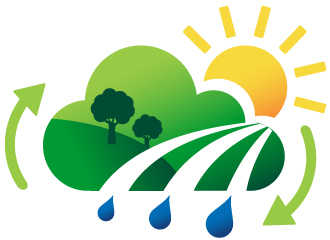
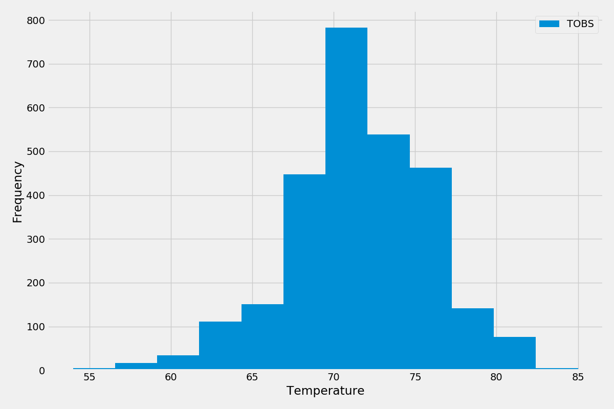

# Climate Analysis and Exploration with SQLAlchemy

---

---

## Contact Information

Rob Savage 

rob.savage@me.com

[LinkedIn](https://www.linkedin.com/in/robsavage/)

[Tableau Public](https://public.tableau.com/profile/rob.savage)

---

## Project Description

The purpose of this project was to do basic climate analysis and data exploration of the climate database then design a Flask API based on the queries that were just developed.

---

## Tools Used

1. Python (Data Aggregation/Cleaning)

    - Pandas Library

2. Matplotlib 

3. Github (Publishing of Results and Analysis)

4. Jupyter Notebook

5. Atom

6. Flask

7. SQLAlchemy

---

## Steps 

1. Chose a start date and end date for the trip and made sure that the vacation range is approximately 3-15 days total.

2. Used SQLAlchemy `create_engine` to connect to the sqlite database.

3. Used SQLAlchemy `automap_base()` to reflect the tables into classes and save a reference to those classes called `Station` and `Measurement`.

4. Designed a query to retrieve the last 12 months of precipitation data.

5. Selected only the `date` and `prcp` values.

6. Loaded the query results into a `Pandas` DataFrame and set the index to the date column.

7. Sorted the DataFrame values by `date`.

8. Plotted the results using the DataFrame `plot` method.

9. Used `Pandas` to print the summary statistics for the precipitation data.

10. Designed a query to calculate the total number of stations.

11. Designed a query to find the most active stations.

12. Designed a query to retrieve the last 12 months of temperature observation data (TOBS).

13. Created a Flask API based on the results

